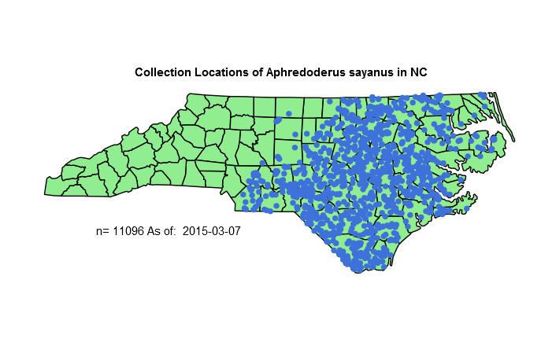
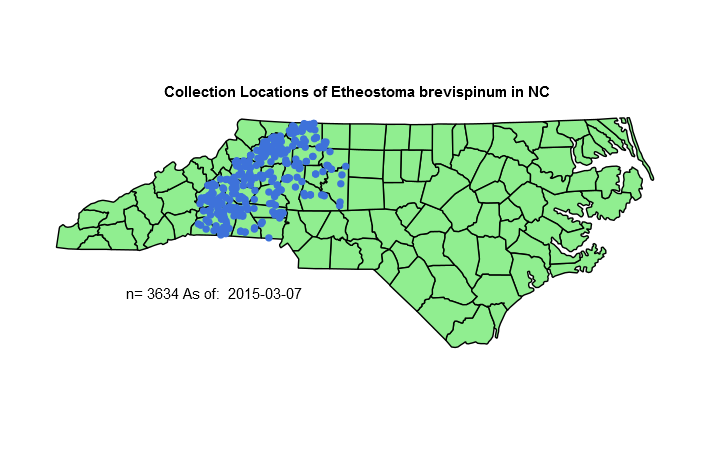

This script is inteded to help create species range maps based on museum collection data sets downloaded from www.fishnet2.net. Museums generally track collections with gps coordinates, or by county or crossroads. This script will clean these data sets, aquire only the data with properly geocoded collection records, and then plot those data on a map of the state drawn in ggplot. I recognize that this may not be the most efficient method, or even the most extensive, but, it works!  

## Requirements  
```{r echo=TRUE,eval=FALSE}
library(Cairo)
library(ggplot2)
```
Also, you will need a csv from fishnet2.net.  


## Data Cleaning  
Our initial function will trim any leading or trailing whitespaces from any string(character) element passed to it.  
```{r trimfunction, echo=TRUE, eval=FALSE}
trim <- function (x) {
        gsub("^\\s+|\\s+$", "", x)
        }
```

The next function is our cleanData function:  
Its job is to clean the data set so that outliers are removed, and gps coordinates are properly formed. Lastly, we clean and trim the IndividualCount Variable. This will later be summed to get a total collections count. If you wish to edit this script for your own state, you must change the bounds to represent your own state.  

```{r cleanData, echo=TRUE, eval=FALSE}

cleanData <- function(name) {
        species <- name
        # subset data by species
        data.sub <- data[data$ScientificName == species,]
        # subset desired columns
        data.sub <- data.sub[,c(4,9,10, 15)]
        names(data.sub) <- c("count", "lat", "lon", "county")
        # Remove any observations with malformed longitudes(Some were 0.00000, 0.0000)
        data.sub <- data.sub[!(data.sub$lon==0 | data.sub$lat==0),]
        # Convert the class from character to numeric
        data.sub$lon <- as.numeric(data.sub$lon)
        data.sub$lat <- as.numeric(data.sub$lat)
        # Repair longitude where author missed a negative (all North America should be +lat, -lon)
        data.sub$lon <- -abs(data.sub$lon)
        # Repair latitude where -lat
        data.sub$lat <- abs(data.sub$lat)
        # Remove ouliers that were incorrectly geolabeled. These values represent the NS and EW bounds of NC 
        # Change these coordinates if you wish to apply this script to your own state
        data.sub <- data.sub[data.sub$lon < -75,]
        data.sub <- data.sub[data.sub$lon > -84.5,]
        data.sub <- data.sub[data.sub$lat < 36.6,]
        data.sub <- data.sub[data.sub$lat > 33.8,]
        # Remove all NA values from data.sub
        data.sub <- data.sub[!is.na(data.sub$lon),]
        
        # Some observations have NA under IndividualCount, Instead of discarding these values, we set all NA's to 1
        # It is safe to assume at least one fish was caught, or they wouldnt be reporting this observation
        data.sub$count[is.na(data.sub$count)] <- 1
        # Remove (70% Ethanol) from the count variable
        data.sub$count <- gsub("\\(.*", "", data.sub$count)
        # Remove whitespaces left over
        data.sub$count <- trim(data.sub$count)
        data.sub$count <- as.numeric(data.sub$count)
        
        return(data.sub)
}
```


## Plotting the data:  

In order to plot the data, many solutions were attempted. We finally landed on using `library(ggplot2)` to get and draw polygons for both the state and for counties. If you wish to edit this for your own state, you will need to adjust the function call `states_map <- map_data("county","north carolina")` to reflect your state.  
The script will create a folder in your working directory called "maps". This folder will then be populated by the maps created in the script, and named by their corresponding scientific names. 

```{r plotting, echo=TRUE, eval=FALSE}
plotData <- function(name, dat){      
        data.sub <- dat
        species <- name
        # exit the plot function if no observations are left in the data after cleaning
        if(length(data.sub$count) < 1) { 
                print(paste("Error with", species))
                return(NULL)
        }
        
        ##############################################
        ## PLOTTING CODE
        ##############################################
        par(mar=c(3.1,3.1,3.1,2.1))
        
        # Create a folder to place maps in
        tempdir <- paste0(getwd(),"/maps")
        if (!file.exists(tempdir)){
                dir.create(tempdir)                
        }
        
        # This creates a variable of the number of observations
        tot <- paste("n=",sum(data.sub$count), "As of: ", Sys.Date())
        
        # Create a string with an underscore between genus and specific epithet
        species.nospace <- gsub("\\s","_",species)
        name <- paste0(getwd(),"/maps/",species.nospace,"_plot1.png")
        #png(name,600,600)
        CairoPNG(filename = name, width = 706, height = 449,
                 pointsize = 12, bg = "transparent")
        # Get polygon data for county shapes
        states_map <- map_data("county","north carolina")
        p <- ggplot() +  
                geom_polygon(data=states_map, aes(x=long, y=lat, group=group), fill="light green",colour="black")+
                coord_map("polyconic") +    
                geom_point(data=data.sub,aes(x=lon, y=lat, group=county), color="#3E72DA", cex=3) + 
                ggtitle(paste("Collection Locations of",species,"in NC")) +
                annotate("text", x = -82, y = 34.5, label = tot) +
                
                theme(axis.line=element_blank(),
                      plot.title = element_text(lineheight=.8, face="bold"),
                      axis.text.x=element_blank(),
                      axis.text.y=element_blank(),
                      axis.ticks=element_blank(),
                      axis.title.x=element_blank(),
                      axis.title.y=element_blank(),
                      panel.background=element_blank(),
                      panel.border=element_blank(),
                      panel.grid.major=element_blank(),
                      panel.grid.minor=element_blank(),
                      plot.background=element_blank())
        print(p)
        dev.off()
}

```

Lastly, the entire script is run through a for loop, that loops over `length(unique(data$ScientificName))`. This is then further whittled down to only observations that contain two or more words in their name. This was done to prevent malformed species names from plotting to graphs. Often, you will find "pomotis" instead of "acantharchus pomotis" in the species name. At the time of writing this, I can think of no way to correct this issue, besides manually correcting all 80k observations, so we just ignore them.   

```{r echo=TRUE,eval=FALSE}
# Load packages
library(Cairo)
library(ggplot2)

# Since we can't download the data automatically, set the path to the location of your csv
# Windows users, note the forward facing slashes! 
csvLocation <- "c:/path/to/your/csv/file/NC Fish Collection Sites.csv"

# Read the csv file downlaoded from fishnet2.net and delete whitespace before and after words
data <- read.csv(csvLocation, header=TRUE, sep=",", stringsAsFactors=FALSE,  strip.white = TRUE, na.strings = c("NA",""))


# Remove blanks and 0's in the longitude variable (i.e. keep only geopositioned collections)
data <- data[which(data$Longitude != ""), ]
data <- data[which(data$Longitude != "0"), ]


speciesCount <- unique(data$ScientificName)
for (i in 1:length(speciesCount)){
        # Some elements of speciescount are malformed "pomotis" instead of "acantharchus pomotis"
        # here we try to look for two or more words in an element
        if(grepl("\\w+\\s\\w+",speciesCount[i])){  
                tempdata <- cleanData(speciesCount[i])
                plotData(speciesCount[i], tempdata)
        }
}

```


## Results  
This script took about 8 minutes to complete on an Intel second gen Corei7 with 10gb RAM, and created 1231 plots.  


